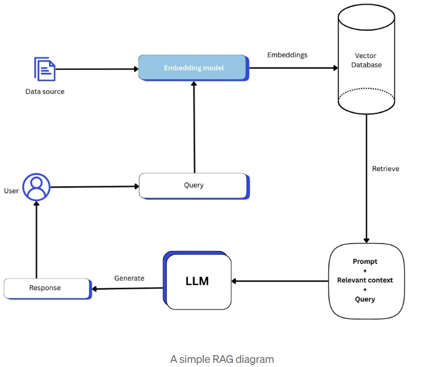

# Retrieval Augmented Generation (RAG) PDF QA System

A simple end-to-end **Retrieval Augmented Generation (RAG)** application that allows users to upload a PDF document and ask questions about its content.

The system extracts text from the PDF, splits it into chunks, converts the chunks into vector embeddings, stores them in a vector database, retrieves relevant chunks based on a user's question, and finally generates an answer using a Large Language Model (LLM).

---

# What is RAG?

**Retrieval Augmented Generation (RAG)** is a technique that improves Large Language Models by providing them with **external knowledge at runtime**.

Instead of relying only on the model's training data, RAG retrieves relevant information from a knowledge base and supplies it to the model as context.



This helps the model:

* answer questions about **private data**
* reduce **hallucinations**
* stay **up-to-date**
* work with **large documents**

---

# Traditional LLM vs RAG

### Traditional LLM

A normal LLM answers based only on its training.

Example:

User asks:

```
What does this company policy say about leave?
```

If the policy is not in the model's training data, the model **cannot answer correctly**.

---

### RAG System

RAG retrieves the relevant text first.

```
User Question
      ↓
Vector Search
      ↓
Relevant Context
      ↓
LLM Answer
```

Now the model answers using the **actual document content**.

---

# Project Architecture

```
                 ┌──────────────┐
                 │    PDF File   │
                 └──────┬───────┘
                        │
                        ▼
                Text Extraction
                        │
                        ▼
                    Chunking
                        │
                        ▼
                  Embeddings
                        │
                        ▼
                 Vector Database
                     (Pinecone)
                        │
                        ▼
User Question → Question Embedding
                        │
                        ▼
                 Vector Similarity Search
                        │
                        ▼
               Retrieved Relevant Chunks
                        │
                        ▼
                    Context Builder
                        │
                        ▼
                     LLM (Groq)
                        │
                        ▼
                     Final Answer
```

---

# System Components

## 1. Document Ingestion Pipeline

This stage prepares documents for retrieval.

```
PDF → Text → Chunks → Embeddings → Vector DB
```

### Step 1: Text Extraction

The system extracts raw text from the PDF.

Example:

PDF content:

```
Artificial Intelligence is the simulation of human intelligence by machines.
Machine learning is a subset of AI.
```

Extracted text:

```
Artificial Intelligence is the simulation of human intelligence by machines...
```

---

### Step 2: Chunking

LLMs cannot process extremely large text inputs efficiently.

So the text is split into **smaller chunks**.

Example:

```
Chunk 1:
Artificial Intelligence is the simulation of human intelligence...

Chunk 2:
Machine learning is a subset of AI...

Chunk 3:
Deep learning uses neural networks...
```

Chunking improves:

* retrieval accuracy
* context efficiency
* embedding quality

---

### Step 3: Embeddings

Each chunk is converted into a **vector representation**.

Example:

```
Text:
"Artificial Intelligence"

Embedding vector:
[0.13, -0.21, 0.56, ...]
```

Similar meanings produce similar vectors.

Example:

```
"AI"
"Artificial Intelligence"
```

Their vectors will be **close in vector space**.

Embeddings are generated using:

```
HuggingFace sentence-transformers
```

Model example:

```
sentence-transformers/all-MiniLM-L6-v2
```

Vector size:

```
384
```

---

### Step 4: Vector Database

All embeddings are stored in **Pinecone**.

Vector databases allow **semantic search**.

Instead of keyword matching, they search by **meaning**.

Example:

Query:

```
What is AI?
```

The vector database retrieves chunks like:

```
Artificial Intelligence is the simulation of human intelligence...
```

even if the exact words are different.

---

# Retrieval Pipeline

When a user asks a question:

```
User Question → Embedding → Vector Search → Context → LLM Answer
```

---

### Step 1: Question Embedding

The question is converted to a vector.

Example:

```
Question:
What is machine learning?
```

Vector:

```
[0.41, -0.02, 0.33, ...]
```

---

### Step 2: Similarity Search

Pinecone finds the most similar vectors.

Example retrieved chunks:

```
Machine learning is a subset of artificial intelligence.

Deep learning is a type of machine learning.
```

---

### Step 3: Context Construction

Retrieved chunks are merged into context.

Example:

```
Context:

Machine learning is a subset of artificial intelligence.

Deep learning is a type of machine learning.
```

---

### Step 4: LLM Generation

The context and question are sent to the LLM.

Example prompt:

```
Use the context below to answer the question.

Context:
Machine learning is a subset of artificial intelligence.

Question:
What is machine learning?
```

LLM generates:

```
Machine learning is a subset of artificial intelligence that enables systems to learn from data and improve performance without explicit programming.
```

The system uses **Groq LLM** for fast inference.

---

# Technologies Used

| Component       | Technology                        |
| --------------- | --------------------------------- |
| Backend         | Node.js + Express                 |
| Embedding Model | HuggingFace sentence-transformers |
| Vector Database | Pinecone                          |
| LLM             | Groq (LLaMA 3.1)                  |
| File Upload     | Multer                            |
| PDF Parsing     | pdf-parse                         |

---


# Advantages of RAG

* Allows LLMs to work with **private data**
* Reduces hallucinations
* Improves answer accuracy
* Scales to large document collections
* Keeps information **up-to-date**

---


# Summary

This project demonstrates a complete **RAG architecture** built using modern AI infrastructure.

The pipeline consists of:

```
Document → Chunking → Embeddings → Vector DB → Retrieval → LLM Answer
```

By combining **vector search with LLM generation**, the system can answer questions about uploaded documents with high accuracy.

---
